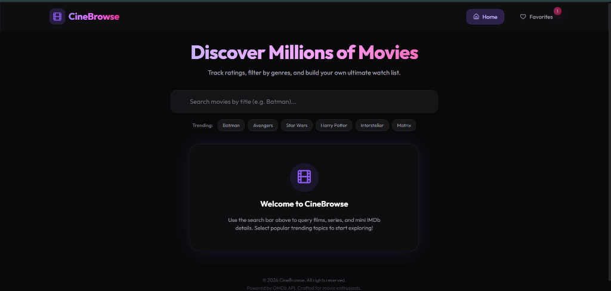
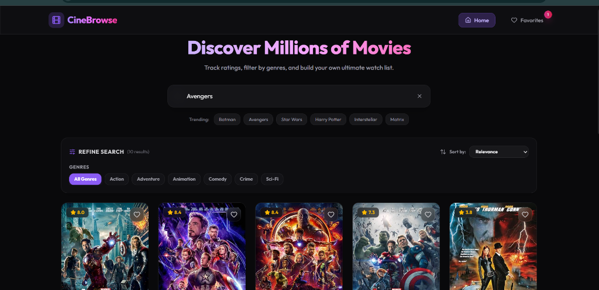

# CineBrowse 🎬

CineBrowse is a premium, responsive React web application designed for exploring movies, tracking ratings, and building a personalized watchlist. It integrates with the external OMDb API securely over HTTPS to retrieve real-time movie data, genres, cast lists, and multiple site reviews.

## 🚀 Key Features

*   **Real-Time Search:** Instantly query movies and series from the OMDb database with clean shimmer skeleton loaders for transition states.
*   **Detailed Metadata:** Access exhaustive profiles containing plot synopses, directors, screenwriters, box office sales, and rating metrics from IMDb, Rotten Tomatoes, and Metacritic.
*   **Immersive Cinematic UI:** High-fidelity layout featuring custom glassmorphism styling and a blurred backdrop effect generated dynamically from the selected film's poster.
*   **Recent Search History:** Log and access your last 8 unique searches in a dropdown list. Click on any past query to search again or clear history instantly.
*   **Interactive Watchlist:** Add movies to your Favorites dashboard with a single click. Watchlist data is fully persisted via browser Local Storage.
*   **Genre & Sorting Refinements:**
    *   **Dynamic Genre Extraction:** Renders clickable filters for genres parsed directly from active search results (e.g. Action, Crime, Sci-Fi).
    *   **Multiple Sort Profiles:** Arrange movies by IMDb Rating, Release Year, or Title Alphabetical.

---

## 📸 Screenshots

### Welcome Page


### Search & Filters Dashboard


---

## 🛠️ Technology Stack

*   **Frontend:** React (v19)
*   **Styling:** Tailwind CSS (v4) with custom design variables and glassmorphism utilities
*   **Icons:** Lucide React
*   **Routing:** React Router DOM (v6)
*   **Data Source:** HTTPS OMDb API
*   **Storage:** HTML5 Local Storage

---

## 📦 Getting Started

### Prerequisites
Make sure you have Node.js (version 20+ recommended) and npm installed.

### Installation
1.  Clone the repository:
    ```bash
    git clone https://github.com/DivyamTheDev/CineBrowse.git
    cd CineBrowse
    ```
2.  Install dependencies:
    ```bash
    npm install
    ```
3.  Start the development server:
    ```bash
    npm run dev
    ```
4.  Open [http://localhost:5173](http://localhost:5173) in your browser to view the application.

### Production Build
To build the application for production:
```bash
npm run build
```
This generates a production bundle in the `dist` directory.
